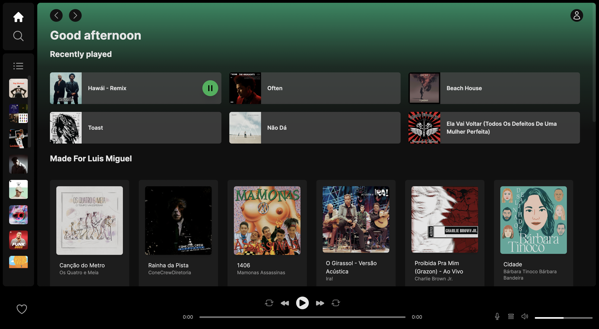

# Spotify UI Clone with Next.js 13 and Tailwind

This project is a clone of the new Spotify UI, built using Next.js 13, Tailwind CSS, and Spotify's Web API. 


## Table of contents

- [Spotify UI Clone with Next.js 13 and Tailwind](#spotify-ui-clone-with-nextjs-13-and-tailwind)
  - [Table of contents](#table-of-contents)
  - [Introduction](#introduction)
  - [Features](#features)
  - [Technologies](#technologies)
  - [Setup](#setup)

## Introduction

This project was created to demonstrate the capabilities of modern frontend technologies such as Next.js and Tailwind CSS, and how they can be used to efficiently clone popular digital products such as Spotify.

## Features

- Responsive design that looks great on both desktop and mobile devices
- Fetches real data from Spotify using their Web API
- Advanced features such as music control, playlists, and search functionality

## Technologies

Project is created with:

- [Next.js](https://nextjs.org/) version 13
- [Tailwind CSS](https://tailwindcss.com/)
- [Spotify Web API](https://developer.spotify.com/documentation/web-api/)

  
  
  
  

## Setup

To run this project, install it locally using npm:

```sh
$ git clone https://github.com/nunatass/spotify-clone.git
$ cd spotify-clone
$ npm install
$ npm run dev
